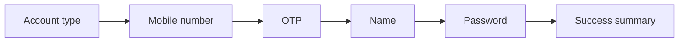

# Root Credit — Frontend Assignment

A multi-step account registration flow built as a frontend assignment. The user moves through a guided wizard — `account type` → `mobile number` → `OTP` → `name` → `password` → `success summary` — with per-step validation, real phone-number handling, animated transitions, and a final summary modal. Built with React 19, TypeScript, Vite, and Tailwind CSS v4.

## Tech stack

- **React 19** + **TypeScript** — UI and type safety.
- **Vite 8** — dev server, HMR, and production builds.
- **Tailwind CSS v4** — styling via the `@tailwindcss/vite` plugin.
- **react-hook-form** + **zod** (`@hookform/resolvers`) — form state and schema-based validation.
- **libphonenumber-js** — country-aware phone validation and as-you-type formatting.
- **framer-motion** — animated step transitions and toasts.
- **lucide-react** — icons.
- **react-country-flag** — flags in the country-code selector.

## Getting started

### Prerequisites

- Node.js 18+ and npm.

### Install and run

- Install dependencies:

```bash
npm install
```

- Start the dev server (Vite with HMR):

```bash
npm run dev
```

- Build for production (`tsc -b && vite build`):

```bash
npm run build
```

- Preview the production build locally:

```bash
npm run preview
```

- Lint the project:

```bash
npm run lint
```

## Architecture overview

### Folder structure

```
src/
  components/
    ui/       Reusable presentational primitives (Button, TextField, Modal, OtpBoxes, ...)
    common/   Shared step scaffolding (StepShell, StepFooter)
    layout/   Page chrome (RegistrationLayout, LeftPanel, ProgressBar)
    steps/    One component per wizard step + the success modal
  context/    React context providers (registration state, toasts)
  hooks/      Custom hooks (useRegistration, useToast, useOtpInput)
  schemas/    Per-step zod validation schemas
  constants/  Step config and country-code data
  types/      Shared domain types
  utils/      Phone and formatting helpers
```

### Composition and flow

`App` wraps the tree in `ToastProvider` → `RegistrationProvider` → `RegistrationWizard`. The step order lives in [src/constants/steps.ts](src/constants/steps.ts) (`STEPS` / `STEP_ORDER`) and drives the `STEP_COMPONENTS` map in [src/components/RegistrationWizard.tsx](src/components/RegistrationWizard.tsx), which renders the active step.



### State management

A single shared `RegistrationContext` ([src/context/RegistrationContext.tsx](src/context/RegistrationContext.tsx)) holds the collected `data`, the `currentStep`, and `isComplete`, and exposes `setData`, `next`, `back`, and `reset`. Steps consume it through the [src/hooks/useRegistration.ts](src/hooks/useRegistration.ts) hook, which throws if used outside the provider. Each step owns its own `react-hook-form` instance, writes its slice back to the context on submit, and advances via `next()`.

## Key decisions and enhancements

- **Config-driven step order** — steps are declared once in [src/constants/steps.ts](src/constants/steps.ts), so reordering or adding a step is a single-file change rather than rewiring navigation logic.
- **Per-step validation** — each step has an isolated `zod` schema in [src/schemas/registrationSchemas.ts](src/schemas/registrationSchemas.ts) wired through `react-hook-form`, keeping validation typed, colocated, and independent.
- **Real phone handling** — [src/utils/phone.ts](src/utils/phone.ts) uses `libphonenumber-js` for genuine per-country validation, as-you-type formatting, and example-based placeholders rather than a naive regex.
- **Accessible OTP input** — a custom [src/hooks/useOtpInput.ts](src/hooks/useOtpInput.ts) hook handles paste, backspace, and arrow-key navigation across the OTP boxes.
- **Animated transitions** — `framer-motion`'s `AnimatePresence` animates steps in and out as the user navigates, and powers the toast notifications.
- **Masked summary** — the success modal shows a privacy-masked mobile number via [src/utils/format.ts](src/utils/format.ts).
- **Accessibility** — `aria-live` toast region, autofocus on relevant inputs, and a labelled success modal.
- **Reusable UI primitives** — shared components are exported from [src/components/ui/index.ts](src/components/ui/index.ts) and composed via `StepShell` / `StepFooter` for consistent layout across steps.
